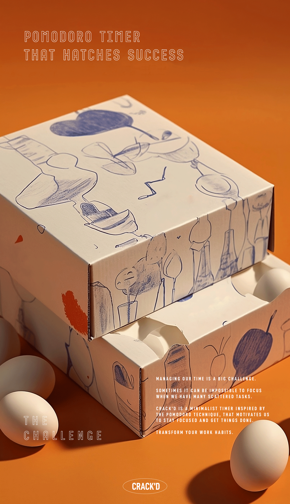
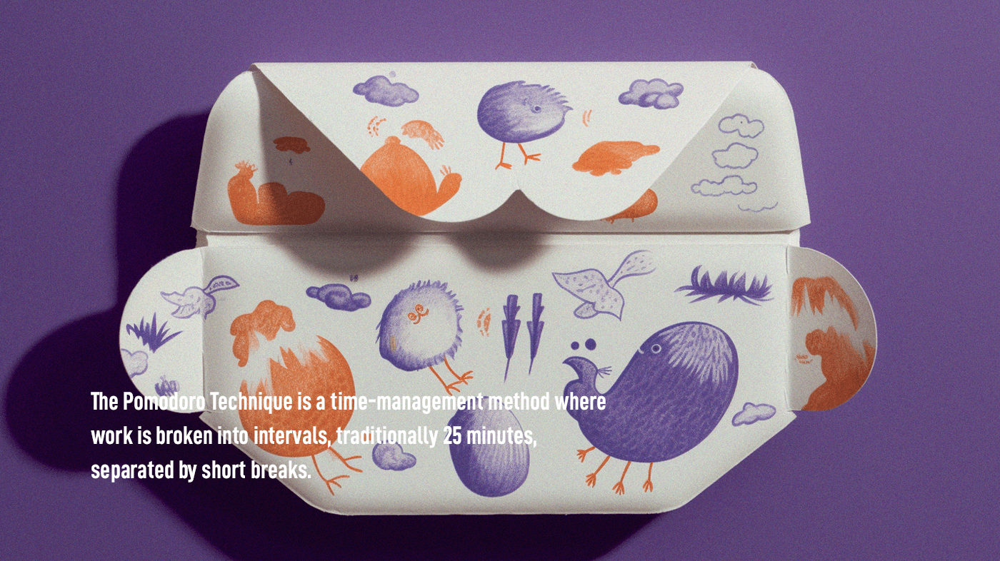
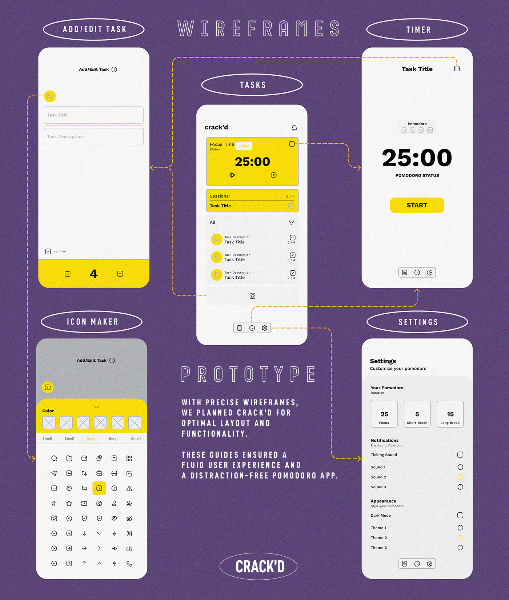
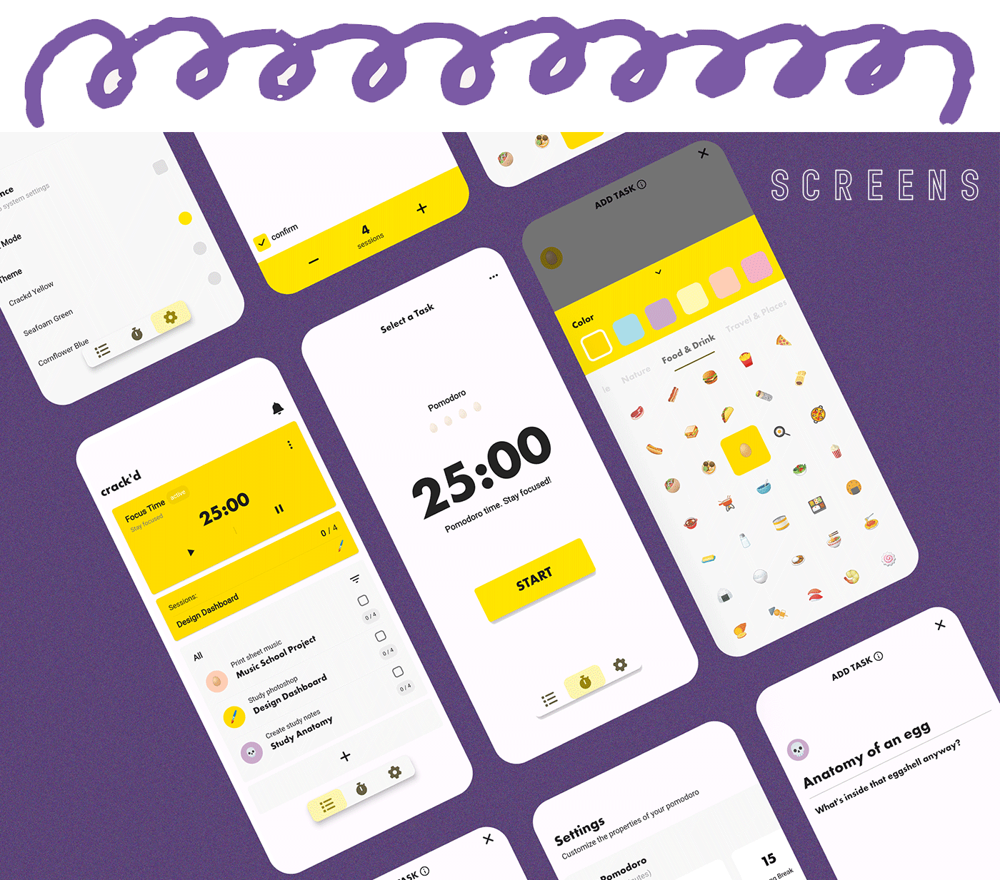
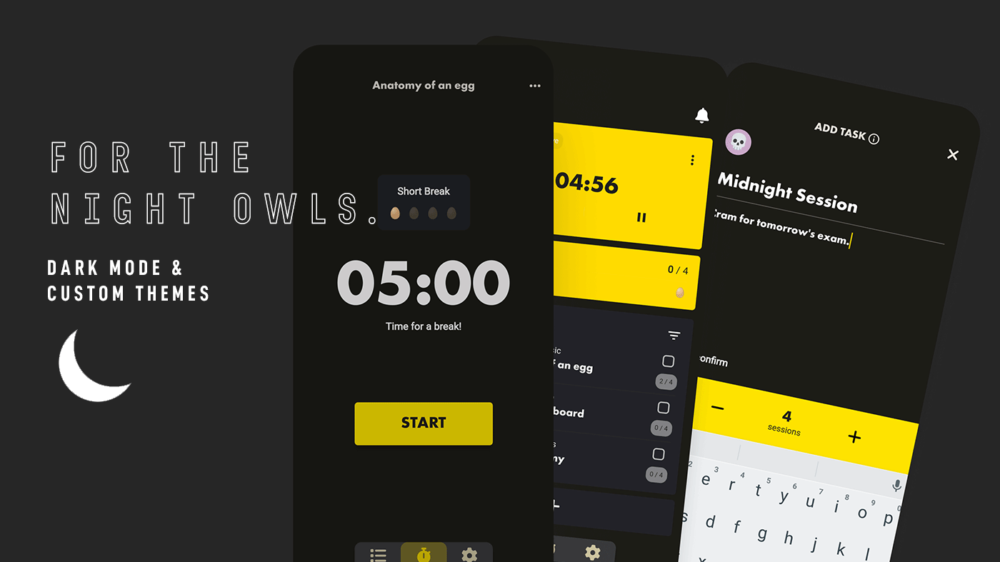

# 🥚🕰️ Crack'd Timer 

Crack'd Timer is a delightful, minimalist pomodoro timer designed to motivate us to stay focused and get things done - one yolk at a time. 

## Table of Contents

- [🌟 Features](#-features)
- [🏗️ Architecture](#-architecture)
- [🔧 Technical Stack](#-technical-stack)
- [🚀 Getting Started](#-getting-started)
- [🤝 Contributing](#-contributing)
- [📝 License](#-license)

## 🌟 Features

Crack'd Timer brings a host of engaging features to boost your productivity:

- **Egg-cellent Interface:** A simple and elegant user interface designed for easy navigation and use.
- **Time Customization:** Ability to set custom focus and break durations.
- **Break Alerts:** Receive periodic notifications to remind you to take breaks.
- **Task Management:** Manage your tasks and task lists with easy tracking.
- **Productivity Stats:** Get detailed insights into your productivity with statistics.
- **Goal Setting:** Set daily goals and track your progress.
- **Visual Themes:** Personalize your app with a variety of themes and a dark mode.
- **Emoji Customization:** Create custom emojis for your tasks to make them more fun and personalized.

## 🏗️ Architecture

Crack'd Timer is designed following principles from Domain-Driven Design (DDD) and Clean Architecture, resulting in a layered architectural style. This approach ensures that our application is maintainable, scalable, and loosely coupled. 

Our architecture is split into the following layers:

- **Presentation**: This layer contains all the UI components, screens, and blocs. It communicates with the Application layer to handle user events and display data.

- **Application**: Here lies the business logic that's pertinent to the application but agnostic to the domain models. This layer translates interactions from the Presentation layer into actions in the Domain layer.

- **Domain**: This layer contains all the business logic that represents the 'real-world' rules of the modality of our app. It includes business objects (models) and failures.

- **Infrastructure**: This layer includes the data source (APIs, local storage) and repositories. The repositories implement the interfaces defined in the domain layer and return data wrapped in a Dartz `Either` type, enabling the handling of failures.

The use of Dartz `Either` type for error handling allows us to wrap computations that can potentially fail, making the system more robust and easier to debug.

## 🔧 Technical Stack

Crack'd Timer is crafted using the following technology stack:

### Frontend:

- **Flutter:** A UI toolkit from Google for building natively compiled applications for mobile, web, and desktop from a single codebase.
- **Riverpod:** A pragmatic state management library used for dependency injection.

### Backend:

- **Flutter Bloc:** A predictable state management library that helps implement the BLoC (Business Logic Component) design pattern.
- **Sembast:** NoSQL persistent embedded file system database for Dart/Flutter. This is used for local data persistence.
- **Auto Route:** An easy yet powerful routing solution, allowing for complex route patterns and transitions.
- **Dartz:** A functional programming library for Dart, used in the app for handling states and results.
- **Other Libraries:** audioplayers and more.

## 🚀 Getting Started

1. Make sure you have [Flutter installed](https://flutter.dev/docs/get-started/install) on your local machine.
2. Clone the repository with `git clone https://github.com/freemantg/crackd_timer.git`.
3. Run `flutter packages get` in the root directory to fetch the project dependencies.
4. Finally, execute `flutter run` to run the project on your device/emulator.

## Contributing 🤝

We welcome contributions from the community. If you wish to contribute, please take a look at our contributing guidelines.

## License 📄

Repo Viewer is licensed under the MIT License. See `LICENSE` for more information.

## Contact 📞

If you have any questions or suggestions, please reach out to us at <contact@freemantang.dev>. We'd love to hear from you!
